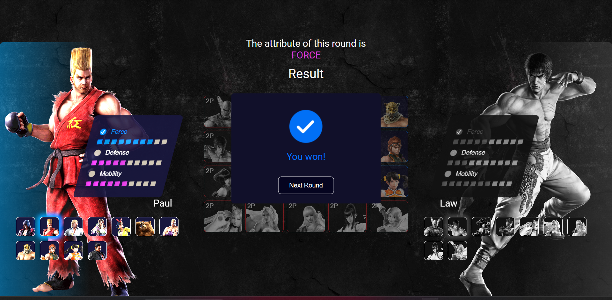

<h1 align="center">
    Tekken Top Trumps Game
</h1>

<div align="center">
   <a href="https://github.com/JohnPetros">
      
   </a>
   
   <a href="https://github.com/JohnPetros/tekken-top-trumps-game/commits/main">
      
   </a>
  </a>
   </a>
   <a href="https://github.com/JohnPetros/tekken-top-trumps-game/blob/main/LICENSE.md">
      
   </a>
    
</div>

<br>

## 🖥️ About the App

This app is a **Top trumps card game** with characters of [Tekken](https://tekken.com/), which is a series of fighting video and arcade developed and published by [Bandai Namco](https://www.bandainamcoent.com/pt_br).

The motivation to create this project was to practice the basics of [framer motion](https://www.googleadservices.com/pagead/aclk?sa=L&ai=DChcSEwi8kq_NvPX_AhUZPNQBHW1CAhMYABAAGgJvYQ&ohost=www.google.com.br&cid=CAESauD29kiBZlDrh2pma-do0uvwX-TjBPAEJJ7T0ZLERyOjV_TzI4gsPooPJJTQyzKc_yV_YLDGcRg5xsbpHEP0YKDv-WuDiBHEjw7b9JznuLCiiz9iWf8p7gCk931OaICxOBvVWJS_nBfcx-s&sig=AOD64_3uRzDpZDmyOFObGu04ImKutXSl5A&q&adurl&ved=2ahUKEwic6aPNvPX_AhXosJUCHUjYD6AQ0Qx6BAgGEAE), which is a powerful and simple React animation library.

## 🕹️ About the Game

The App has two players: player One (user) and Player Two (bot) and follows the rules of a typical Top trumps card game, which are:

- At the beginning each player must select 10 fighters from the central deck.
- Each fighter has three attributes (`Force`, `Defense` and `Mobillity`) with their respective values.
- The game is divided by rounds where one of the players has to set one attribute that will be use to compare the fighters.
- The player whose fighter with a higher round attribute value than the other fighter wins the round.
- The loser player's fighter is taken from his/her deck and placed in the winner player's.
- In the next round the other player must set the attribute of this round and then the cycle repeats itself.
- The player with all fighters wins the game!

### ⏹️ Demonstration

<div align="center">
  
</div>

---

## ✨ Features

- [x] All user's actions have animation feedback. 💫
- [x] Events of some elements are blocked depending on the actual state of the game.
- [x] The appearance of the each fighter card indicates which player it belongs to.
- [x] Player Two's actions are performed randomly to emulate a real user.
- [x] At final of each round, as well as the end of game, a modal opens to shows the result. Of course, the modal's content is dynamicaly modified depending on the result
- [x] Once the game is over, user can restart the game.

---

## 🛠️ Technologies

This app was developed using the following technologies:

✔️ **[ReactJs](https://react.dev/)**

✔️ **[TypeScript](https://www.typescriptlang.org/)**

✔️ **[Framer Motion](https://www.framer.com/motion/)**

✔️ **[Styled Components](https://styled-components.com/)**

✔️ **[Lottie](https://lottiefiles.com/)**

---

## 🚀 How to run this app?

### Prerequisites

You will need a package manager like [npm](https://www.npmjs.com/) or [yarn](https://yarnpkg.com/) to run the application.

#### 📟 Running the application

```bash

# Clone this repo
$ git clone https://github.com/JohnPetros/tekken-top-trumps-game.git

# Access the app's folder
$ cd tekken-top-trumps-game

# Install the dependecies
$ npm install or yarn add

# Run the app in development mode
$ npm run dev or yarn dev

# Probably the app will runnig on http://localhost:5173

```

---

## ⚙️ Deploy

This app was deployed by **[Vercel](https://vercel.com/home)**. This means you can access the running app by accessing this **[link](https://tekken-top-trumps-game-pearl.vercel.app/)**.

---

## 💪 How to contribute

```bash

# Fork this repo
$ git clone https://github.com/JohnPetros/tekken-top-trumps-game.git

# Create a branch with your feature
$ git checkout -b my-feature

# Commit your changes:
$ git commit -m 'feat: My new feature'

# Push to your branch:
$ git push origin my-feature

```

> You also can open a [new issue report](https://github.com/JohnPetros/tekken-top-trumps-game/issues). It will be an honor to be able to help you and improve this application as well.

---

## 📝 License

This app is under MIT lincese. See the [License file](LICENSE) for more details.

---

<p align="center">
   Made with 💜 by John Petros 👋🏻
</p>
